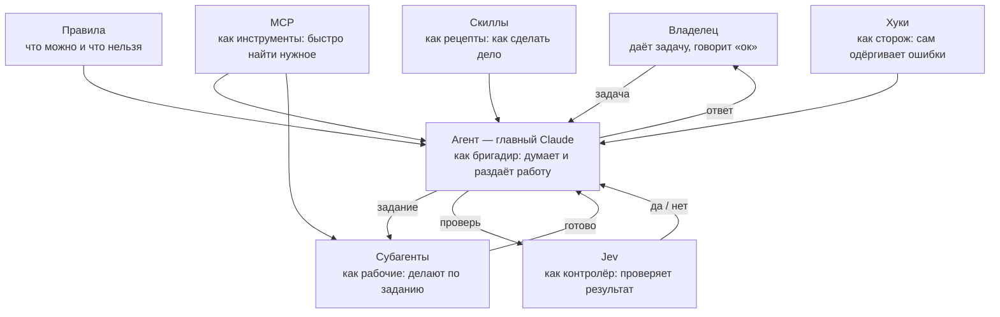

```mermaid
flowchart TB
    owner["Владелец<br/>даёт задачу, говорит «ок»"]
    agent["Агент — главный Claude<br/>как бригадир: думает и раздаёт работу"]
    sub["Субагенты<br/>как рабочие: делают по заданию"]
    jev["Jev<br/>как контролёр: проверяет результат"]
    rules["Правила<br/>что можно и что нельзя"]
    skill["Скиллы<br/>как рецепты: как сделать дело"]
    hook["Хуки<br/>как сторож: сам одёргивает ошибки"]
    mcp["MCP<br/>как инструменты: быстро найти нужное"]

    owner -->|"задача"| agent
    agent -->|"ответ"| owner
    agent -->|"задание"| sub
    sub -->|"готово"| agent
    agent -->|"проверь"| jev
    jev -->|"да / нет"| agent
    rules --> agent
    skill --> agent
    hook --> agent
    mcp --> agent
    mcp --> sub
```
