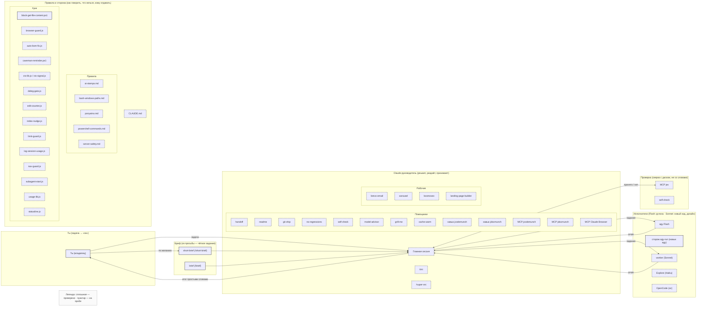

```mermaid
flowchart LR
    subgraph SG_YOU ["Ты (задача → «ок»)"]
        you["Ты (владелец)"]:::ok
    end

    subgraph SG_BRIEF ["Бриф (из просьбы — чёткое задание)"]
        brief["brief (/brief)"]:::ok
        short_brief["short-brief (/short-brief)"]:::ok
    end

    subgraph SG_LEAD ["Claude-руководитель (решает, раздаёт, принимает)"]
        lead_session["Главная сессия"]:::trial
        mode_orc["/orc"]:::trial
        mode_super_orc["/super-orc"]:::trial

        subgraph SG_HELPERS ["Помощники"]
            h_handoff["handoff"]:::trial
            h_readme["readme"]:::trial
            h_git_ship["git-ship"]:::trial
            h_no_reg["no-regressions"]:::trial
            h_self_check["self-check"]:::trial
            h_model_adv["model-advisor"]:::trial
            h_grill_me["grill-me"]:::trial
            h_cache_warm["cache-warm"]:::trial
            h_jcode_skill["навык jcodemunch"]:::trial
            h_jdoc_skill["навык jdocmunch"]:::trial
            mcp_jcode["MCP jcodemunch"]:::trial
            mcp_jdoc["MCP jdocmunch"]:::trial
            mcp_browser["MCP Claude Browser"]:::trial
        end

        subgraph SG_WORKERS ["Рабочие"]
            w_brevo["brevo-email"]:::trial
            w_carousel["carousel"]:::trial
            w_kosmoseo["kosmoseo"]:::trial
            w_lpb["landing-page-builder"]:::trial
        end
    end

    subgraph SG_EXEC ["Исполнители (Flash: рутина · Sonnet: новый код, дизайн)"]
        exec_flash["agy Flash"]:::trial
        exec_watchdog["сторож agy-run (навык agy)"]:::ok
        exec_worker["worker (Sonnet)"]:::trial
        exec_explore["Explore (Haiku)"]:::trial
        exec_oc["OpenCode (oc)"]:::trial
    end

    subgraph SG_CHECK ["Проверка (сверка с диском, не со словами)"]
        check_jev["MCP jev"]:::trial
        check_self["self-check"]:::trial
    end

    subgraph SG_RULES ["Правила и сторожа (как говорить, что нельзя, кому отдавать)"]
        rule_claude_md["CLAUDE.md"]:::trial

        subgraph SG_RULE_FILES ["Правила"]
            r_stamps["ai-stamps.md"]:::trial
            r_bash["bash-windows-paths.md"]:::trial
            r_ponyatno["ponyatno.md"]:::trial
            r_ps["powershell-commands.md"]:::trial
            r_safety["server-safety.md"]:::trial
        end

        subgraph SG_HOOKS ["Хуки"]
            hk_block_get["block-get-file-content.ps1"]:::ok
            hk_browser_guard["browser-guard.js"]:::trial
            hk_auto_bom["auto-bom-fix.js"]:::trial
            hk_caveman["caveman-reminder.ps1"]:::trial
            hk_ctx["ctx-lib.js / ctx-signal.js"]:::trial
            hk_deleg["deleg-gate.js"]:::trial
            hk_edit["edit-counter.js"]:::trial
            hk_nudge["index-nudge.js"]:::trial
            hk_limit["limit-guard.js"]:::trial
            hk_log["log-session-usage.js"]:::trial
            hk_nav["nav-guard.js"]:::trial
            hk_subagent["subagent-start.js"]:::trial
            hk_usage["usage-lib.js"]:::trial
            hk_statusline["statusline.js"]:::trial
        end
    end

    legend["Легенда: сплошная — проверено · пунктир — на пробе"]:::legendBox

    you -->|"задача"| lead_session
    lead_session -->|"итог простыми словами"| you
    you -->|"по желанию"| short_brief
    short_brief --> lead_session
    brief --> lead_session
    lead_session -->|"задание"| exec_flash
    lead_session -->|"задание"| exec_worker
    exec_flash -->|"отчёт"| lead_session
    exec_worker -->|"отчёт"| lead_session
    lead_session <-->|"принято / нет"| check_jev

    classDef ok stroke:#333,stroke-width:1.5px;
    classDef trial stroke:#333,stroke-width:1.5px,stroke-dasharray:5 4;
    classDef legendBox fill:#fafafa,stroke:#999,stroke-width:1px;
```
